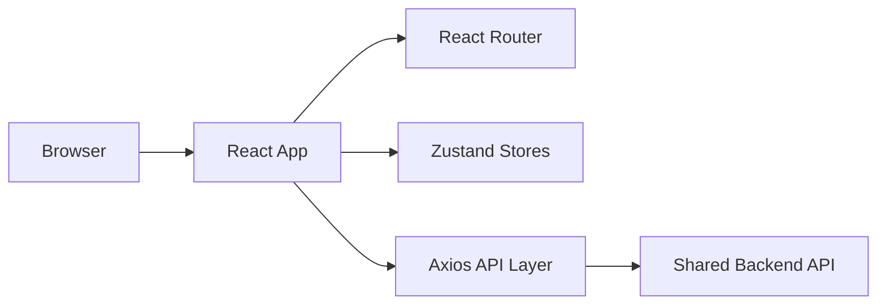
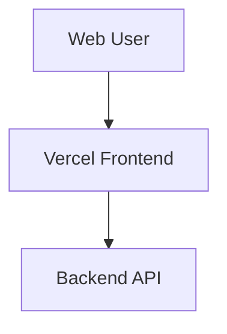

# Frontend Architecture

## Purpose

This frontend is the web client for Family Finance Tracker. It consumes the shared backend API and presents the finance workflows used by the user.

## High-Level Design



## Main Layers

### App Shell

Files:

- `src/main.jsx`
- `src/App.jsx`

Responsibilities:

- App bootstrapping
- Router setup
- Auth initialization
- Route protection

### API Layer

Files:

- `src/api/client.js`
- `src/api/auth.api.js`
- `src/api/expenses.api.js`
- `src/api/finance.api.js`
- `src/api/analytics.api.js`

Responsibilities:

- Base URL configuration through `VITE_API_BASE_URL`
- Access token attachment
- Refresh token retry flow
- Thin HTTP wrappers around backend endpoints

### State Layer

Files:

- `src/store/auth.store.js`
- `src/store/ui.store.js`

Responsibilities:

- User/session state
- Workspace selection
- UI notifications and app-level state

### Layout Layer

Files:

- `src/components/layout/*`
- `src/components/shared/*`

Responsibilities:

- Header and navigation
- Page shells
- Cards and summaries
- Buttons, inputs, modals, toasts, and empty states

### Page Layer

Files:

- `src/pages/auth/*`
- `src/pages/expenses/*`
- `src/pages/loans/*`
- `src/pages/investments/*`
- `src/pages/insurance/*`
- `src/pages/overview/*`
- `src/pages/banks/*`
- `src/pages/analytics/*`
- `src/pages/Settings.jsx`

Responsibilities:

- Module-specific UI
- User interaction
- API calls and rendering

## Main User Modules

- Login and signup
- Expenses
- Loans
- Investments
- Insurance
- Overview
- Banks
- Analytics
- Settings

## Styling Model

Files:

- `src/styles/global.css`

Approach:

- Shared CSS variables
- Responsive spacing and typography
- Shared component styling patterns

## Testing

Files:

- `e2e/app.e2e.spec.js`

Responsibilities:

- Cross-page browser verification
- Critical auth and CRUD smoke coverage

## Deployment Shape

Deploy the frontend separately from the backend.

Recommended production topology:



Frontend environment:

```env
VITE_API_BASE_URL="https://api.yourdomain.com/api/v1"
```

## Boundaries

This repo should own:

- UI and UX
- Page routing
- Browser behavior
- Frontend tests

This repo should not own:

- Business rule source of truth
- Database schema
- API contract definition
- Auth token issuing logic
